# Diagrama de Flujo: Asignación de Cursos con LIA

```mermaid
flowchart TD
    Start([Admin abre modal de asignación]) --> SelectUsers[Selecciona usuarios/equipos]
    SelectUsers --> ClickLIA{Click en 'Sugerir con LIA'}

    ClickLIA -->|Sí| OpenModal[Abre Modal LIA]
    ClickLIA -->|No| ManualDate[Define fecha manualmente]

    OpenModal --> Step1[Paso 1: Selección de Enfoque]
    Step1 --> ChooseApproach{Elige enfoque}

    ChooseApproach -->|Rápido| FetchFast[Fetch API con enfoque fast]
    ChooseApproach -->|Equilibrado| FetchBalanced[Fetch API con enfoque balanced]
    ChooseApproach -->|Largo| FetchLong[Fetch API con enfoque long]

    FetchFast --> APICall[GET /deadline-suggestions]
    FetchBalanced --> APICall
    FetchLong --> APICall

    APICall --> CalcMetadata[Obtener metadata del curso]
    CalcMetadata --> CalcSuggestions[Calcular 3 sugerencias]
    CalcSuggestions --> ApplyAdjustments[Aplicar ajustes por complejidad]
    ApplyAdjustments --> ReturnSuggestions[Retornar sugerencias]

    ReturnSuggestions --> Step2[Paso 2: Mostrar Sugerencias]
    Step2 --> ShowCards[Mostrar 3 cards con opciones]

    ShowCards --> SelectSuggestion{Usuario selecciona}
    SelectSuggestion -->|Card 1| Step3
    SelectSuggestion -->|Card 2| Step3
    SelectSuggestion -->|Card 3| Step3
    SelectSuggestion -->|Volver| Step1

    Step3[Paso 3: Confirmación]
    Step3 --> ShowSummary[Mostrar resumen de selección]
    ShowSummary --> StartDatePicker[Selector de fecha de inicio]

    StartDatePicker --> ConfirmAction{Confirmar o Volver}
    ConfirmAction -->|Volver| Step2
    ConfirmAction -->|Confirmar| TransferData[Transferir datos al modal principal]

    ManualDate --> FillMainModal[Llenar campos del modal principal]
    TransferData --> FillMainModal

    FillMainModal --> ValidateDates{Validar fechas}
    ValidateDates -->|start_date > due_date| ShowError[Mostrar error]
    ValidateDates -->|Válido| AssignCourse[POST /assign con datos]

    ShowError --> FillMainModal

    AssignCourse --> SaveDB[Guardar en BD]
    SaveDB --> CheckConstraint{Constraint check_start_before_due}

    CheckConstraint -->|Falla| ErrorDB[Error de BD]
    CheckConstraint -->|Pasa| CreateEnrollment[Crear enrollment]

    ErrorDB --> ShowError
    CreateEnrollment --> Success[Asignación exitosa]
    Success --> CloseModal[Cerrar modales]
    CloseModal --> End([Fin])

    style Start fill:#8B5CF6,stroke:#7C3AED,color:#fff
    style End fill:#10B981,stroke:#059669,color:#fff
    style OpenModal fill:#3B82F6,stroke:#2563EB,color:#fff
    style Step1 fill:#3B82F6,stroke:#2563EB,color:#fff
    style Step2 fill:#3B82F6,stroke:#2563EB,color:#fff
    style Step3 fill:#3B82F6,stroke:#2563EB,color:#fff
    style APICall fill:#F59E0B,stroke:#D97706,color:#fff
    style CalcSuggestions fill:#F59E0B,stroke:#D97706,color:#fff
    style AssignCourse fill:#EF4444,stroke:#DC2626,color:#fff
    style Success fill:#10B981,stroke:#059669,color:#fff
    style ShowError fill:#EF4444,stroke:#DC2626,color:#fff
```



## Descripción de Componentes

### 🎯 Puntos de Entrada

- **Admin abre modal**: Desde la página de Talleres
- **Click en 'Sugerir con LIA'**: Botón junto al campo de fecha límite

### 📊 Pasos del Modal LIA

#### Paso 1: Selección de Enfoque

- **Opciones**: Rápido, Equilibrado, Largo
- **UI**: 3 cards con iconos, títulos y descripciones
- **Acción**: Click en card → Fetch API

#### Paso 2: Sugerencias

- **Entrada**: Respuesta de API con 3 sugerencias
- **UI**: 3 cards con fecha límite, duración, ritmo
- **Acción**: Click en card → Paso 3

#### Paso 3: Confirmación

- **UI**: Resumen de selección + selector de fecha de inicio
- **Validación**: Fecha de inicio <= fecha límite
- **Acción**: Confirmar → Transferir datos

### 🔧 Backend

#### API: `/deadline-suggestions`

1. **Autenticación**: Verificar admin/owner
2. **Obtener metadata**: Duración, lecciones, actividades
3. **Calcular sugerencias**: 3 opciones (fast, balanced, long)
4. **Aplicar ajustes**: Por complejidad del curso
5. **Retornar JSON**: Con las 3 sugerencias

#### API: `/assign`

1. **Validar body**: user_ids, due_date, start_date, approach
2. **Validar fechas**: start_date <= due_date
3. **Validar approach**: fast, balanced, long, custom
4. **Crear assignments**: En BD con constraint check
5. **Crear enrollments**: Si no existen
6. **Retornar success**: Con datos de asignación

### 💾 Base de Datos

#### Tabla: `organization_course_assignments`

```sql
Campos nuevos:
- start_date: timestamp (nullable)
- approach: varchar (nullable, check constraint)

Constraint:
- check_start_before_due: start_date <= due_date

Índice:
- idx_org_course_assignments_start_date
```

---

## Flujo de Datos

```
┌─────────────────┐
│  Admin (UI)     │
└────────┬────────┘
         │ 1. Click "Sugerir con LIA"
         ▼
┌─────────────────┐
│  Modal LIA      │
│  (Frontend)     │
└────────┬────────┘
         │ 2. Selecciona enfoque
         ▼
┌─────────────────┐
│  API Gateway    │
│  /deadline-     │
│  suggestions    │
└────────┬────────┘
         │ 3. Fetch metadata
         ▼
┌─────────────────┐
│  Supabase       │
│  (courses,      │
│   lessons,      │
│   activities)   │
└────────┬────────┘
         │ 4. Retorna metadata
         ▼
┌─────────────────┐
│  Calculator     │
│  (Backend)      │
│  - Calcula 3    │
│    sugerencias  │
│  - Aplica       │
│    ajustes      │
└────────┬────────┘
         │ 5. Retorna sugerencias
         ▼
┌─────────────────┐
│  Modal LIA      │
│  (Frontend)     │
│  - Muestra      │
│    opciones     │
└────────┬────────┘
         │ 6. Usuario confirma
         ▼
┌─────────────────┐
│  Modal Principal│
│  (Frontend)     │
│  - Recibe datos │
│  - Valida       │
└────────┬────────┘
         │ 7. POST /assign
         ▼
┌─────────────────┐
│  API Gateway    │
│  /assign        │
│  - Valida       │
│  - Crea records │
└────────┬────────┘
         │ 8. INSERT
         ▼
┌─────────────────┐
│  Supabase       │
│  (organization_ │
│   course_       │
│   assignments)  │
└─────────────────┘
```

---

## Estados del Modal LIA

```
┌──────────────────────────────────────────┐
│ Estado: 'approach'                       │
│ ┌──────────────────────────────────────┐ │
│ │ ¿Con qué enfoque quieres hacer       │ │
│ │ el curso?                            │ │
│ │                                      │ │
│ │ [🚀 Rápido]                          │ │
│ │ [⚖️ Equilibrado]                     │ │
│ │ [🌱 Largo]                           │ │
│ └──────────────────────────────────────┘ │
└──────────────────────────────────────────┘
                  │
                  ▼ (selecciona enfoque)
┌──────────────────────────────────────────┐
│ Estado: 'suggestions'                    │
│ ┌──────────────────────────────────────┐ │
│ │ Sugerencias de fecha límite          │ │
│ │                                      │ │
│ │ [🚀 Rápido - 14 días]                │ │
│ │ [⚖️ Equilibrado - 35 días]           │ │
│ │ [🌱 Largo - 70 días]                 │ │
│ │                                      │ │
│ │ [Volver]                             │ │
│ └──────────────────────────────────────┘ │
└──────────────────────────────────────────┘
                  │
                  ▼ (selecciona sugerencia)
┌──────────────────────────────────────────┐
│ Estado: 'confirm'                        │
│ ┌──────────────────────────────────────┐ │
│ │ Confirmar asignación                 │ │
│ │                                      │ │
│ │ Enfoque: Equilibrado                 │ │
│ │ Fecha límite: 31 Ene 2026            │ │
│ │ Duración: 5 semanas                  │ │
│ │                                      │ │
│ │ Fecha de inicio: [selector]          │ │
│ │                                      │ │
│ │ [Volver] [Confirmar Asignación]      │ │
│ └──────────────────────────────────────┘ │
└──────────────────────────────────────────┘
```

---

## Validaciones en Cada Paso

### Frontend (Modal LIA)

- ✓ Enfoque seleccionado antes de continuar
- ✓ Sugerencia seleccionada antes de confirmar
- ✓ Fecha de inicio es válida (formato correcto)

### Backend (API)

- ✓ Usuario autenticado
- ✓ Usuario es admin/owner
- ✓ Curso existe y está activo
- ✓ start_date <= due_date
- ✓ approach en ['fast', 'balanced', 'long', 'custom']

### Base de Datos

- ✓ Constraint: check_start_before_due
- ✓ Foreign keys válidas
- ✓ Tipos de datos correctos

---

**Creado:** 2025-12-27  
**Versión:** 1.0
