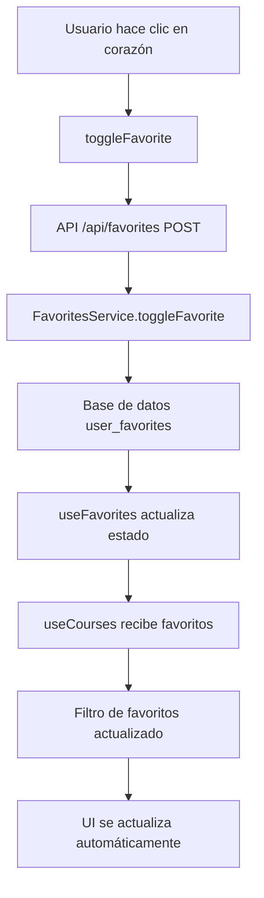

# Corrección de Favoritos - Implementación

## ✅ **Problemas Identificados y Solucionados**

### 🐛 **Problema 1: Datos Hardcodeados**
- **Antes**: Los datos mock tenían `isFavorite: true/false` hardcodeado
- **Después**: Los favoritos se obtienen dinámicamente del hook `useFavorites`

### 🐛 **Problema 2: Toggle de Favoritos No Funcionaba**
- **Antes**: El botón de corazón no respondía correctamente
- **Después**: Integración completa entre `useFavorites` y `useCourses`

### 🐛 **Problema 3: Filtro de Favoritos Incorrecto**
- **Antes**: El filtro "Favoritos" mostraba cursos que no eran favoritos
- **Después**: Filtro basado en la lista real de favoritos del usuario

## 🛠️ **Correcciones Implementadas**

### 1. **Eliminación de Datos Hardcodeados**
```typescript
// ANTES (hardcodeado)
const mockWorkshops = [
  { id: '1', title: 'Curso 1', isFavorite: true },  // ❌ Hardcodeado
  { id: '2', title: 'Curso 2', isFavorite: false }, // ❌ Hardcodeado
];

// DESPUÉS (dinámico)
const workshops = filteredCourses.map(course => ({
  ...course,
  isFavorite: isFavorite(course.id) // ✅ Dinámico desde hook
}));
```

### 2. **Integración de Hooks**
```typescript
// Hook de cursos actualizado
const { setFavorites } = useCourses();
const { favorites, toggleFavorite, isFavorite } = useFavorites();

// Sincronización automática
React.useEffect(() => {
  setFavorites(favorites);
}, [favorites, setFavorites]);
```

### 3. **Filtro de Favoritos Corregido**
```typescript
// ANTES (incorrecto)
if (activeFilter === 'favorites') {
  return courses.filter(course => course.isFavorite) // ❌ Usaba campo hardcodeado
}

// DESPUÉS (correcto)
if (activeFilter === 'favorites') {
  return courses.filter(course => userFavorites.includes(course.id)) // ✅ Usa lista real
}
```

## 📁 **Archivos Modificados**

### `apps/web/src/app/dashboard/page.tsx`
- ✅ Eliminados favoritos hardcodeados de mock data
- ✅ Integración con hook `useFavorites`
- ✅ Sincronización automática de favoritos
- ✅ Uso de `isFavorite(courseId)` para estado dinámico

### `apps/web/src/features/courses/hooks/useCourses.ts`
- ✅ Agregado estado `userFavorites`
- ✅ Método `setFavorites` para sincronización
- ✅ Filtro de favoritos basado en lista real
- ✅ Dependencia `userFavorites` en `useMemo`

### `apps/web/scripts/test-favorites.sql`
- ✅ Script para probar funcionalidad de favoritos
- ✅ Verificación de tabla y datos
- ✅ Consultas de prueba

## 🚀 **Cómo Probar las Correcciones**

### 1. **Configurar Base de Datos**
```sql
-- Ejecutar en Supabase SQL Editor:
-- 1. apps/web/scripts/create-favorites-table.sql
-- 2. apps/web/scripts/seed-courses.sql
-- 3. apps/web/scripts/test-favorites.sql
```

### 2. **Probar Toggle de Favoritos**
1. Ve a `http://localhost:3000/dashboard`
2. Haz clic en el corazón de cualquier curso
3. El corazón debe cambiar de vacío a lleno (rojo)
4. Haz clic nuevamente para removerlo

### 3. **Probar Filtro de Favoritos**
1. Agrega algunos cursos a favoritos
2. Haz clic en el filtro "Favoritos"
3. Solo deben aparecer los cursos que marcaste como favoritos
4. Haz clic en "Todos" para ver todos los cursos

### 4. **Verificar Persistencia**
1. Recarga la página
2. Los favoritos deben mantenerse
3. El filtro "Favoritos" debe seguir funcionando

## 🔧 **Flujo de Datos Corregido**



## 🎯 **Estados Visuales**

### Corazón de Favorito
- **No favorito**: Corazón gris vacío (`text-text-secondary`)
- **Favorito**: Corazón rojo lleno (`text-red-500 fill-current`)
- **Hover**: Fondo del botón cambia

### Filtro de Favoritos
- **Activo**: Fondo azul (`bg-primary`)
- **Inactivo**: Fondo gris (`bg-carbon-700`)
- **Resultado**: Solo cursos marcados como favoritos

## 🐛 **Troubleshooting**

### El corazón no cambia al hacer clic
- Verifica que estés autenticado
- Revisa la consola del navegador para errores
- Verifica que la tabla `user_favorites` existe

### El filtro "Favoritos" está vacío
- Asegúrate de haber marcado algunos cursos como favoritos
- Verifica que los favoritos se están guardando en la BD
- Revisa la consola para errores de API

### Los favoritos no persisten
- Verifica que la tabla `user_favorites` tiene RLS configurado
- Revisa que el usuario está autenticado correctamente
- Verifica que las variables de entorno están configuradas

## ✨ **Beneficios de las Correcciones**

- ✅ **Sin datos hardcodeados** - Todo es dinámico
- ✅ **Toggle funcional** - Los corazones responden correctamente
- ✅ **Filtro preciso** - Solo muestra favoritos reales
- ✅ **Persistencia** - Los favoritos se guardan en la BD
- ✅ **Sincronización** - Estado consistente entre componentes
- ✅ **UX mejorada** - Feedback visual inmediato

## 🎯 **Próximos Pasos**

1. **Contador de favoritos** - Mostrar número en el botón de filtro
2. **Animaciones** - Transiciones suaves para el toggle
3. **Notificaciones** - Toast cuando se agrega/remueve favorito
4. **Favoritos masivos** - Seleccionar múltiples cursos
5. **Exportar favoritos** - Lista de favoritos para compartir
