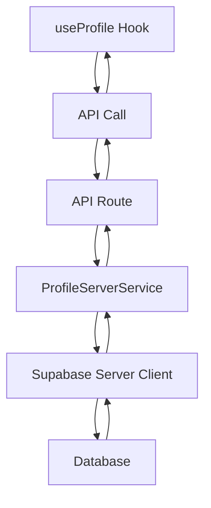

# Corrección de Error Server/Client Component

## ✅ **Problema Identificado y Solucionado**

### 🐛 **Error Principal**
```
Error: You're importing a component that needs "next/headers". 
That only works in a Server Component which is not supported in the pages/ directory.
```

### 🔍 **Causa del Error**
- El `ProfileService` estaba importando `createClient` del servidor (`next/headers`)
- Se estaba usando en un hook cliente (`useProfile`)
- Next.js no permite usar `next/headers` en componentes cliente

## 🛠️ **Correcciones Implementadas**

### 1. **Cliente de Supabase para el Lado Cliente**
```typescript
// apps/web/src/lib/supabase/client.ts
import { createBrowserClient } from '@supabase/ssr'

export function createClient() {
  return createBrowserClient<Database>(
    process.env.NEXT_PUBLIC_SUPABASE_URL!,
    process.env.NEXT_PUBLIC_SUPABASE_ANON_KEY!
  )
}
```

### 2. **Servicio de Perfil para el Cliente**
```typescript
// apps/web/src/features/profile/services/profile.service.ts
import { createClient } from '../../../lib/supabase/client'

export class ProfileService {
  static async getProfile(userId: string): Promise<UserProfile> {
    const supabase = createClient() // No async
    // ... resto del código
  }
}
```

### 3. **Servicio de Perfil para el Servidor**
```typescript
// apps/web/src/features/profile/services/profile-server.service.ts
import { createClient } from '../../../lib/supabase/server'

export class ProfileServerService {
  static async getProfile(userId: string): Promise<UserProfile> {
    const supabase = await createClient() // Async
    // ... resto del código
  }
}
```

### 4. **Hook Actualizado para Usar API Routes**
```typescript
// apps/web/src/features/profile/hooks/useProfile.ts
const fetchProfile = useCallback(async () => {
  const response = await fetch('/api/profile')
  const profileData = await response.json()
  setProfile(profileData)
}, [user?.id])

const updateProfile = useCallback(async (updates) => {
  const response = await fetch('/api/profile', {
    method: 'PUT',
    headers: { 'Content-Type': 'application/json' },
    body: JSON.stringify(updates)
  })
  const updatedProfile = await response.json()
  setProfile(updatedProfile)
}, [user?.id])
```

### 5. **API Routes Actualizadas**
```typescript
// apps/web/src/app/api/profile/route.ts
import { ProfileServerService } from '../../../features/profile/services/profile-server.service'

export async function GET(request: NextRequest) {
  const profile = await ProfileServerService.getProfile(user.id)
  return NextResponse.json(profile)
}

export async function PUT(request: NextRequest) {
  const updates = await request.json()
  const updatedProfile = await ProfileServerService.updateProfile(user.id, updates)
  return NextResponse.json(updatedProfile)
}
```

## 🎯 **Arquitectura Corregida**

### **Antes (Problemático)**
```
useProfile (Client) → ProfileService → createClient (Server) ❌
```

### **Después (Correcto)**
```
useProfile (Client) → API Routes → ProfileServerService → createClient (Server) ✅
```

## 🔧 **Separación de Responsabilidades**

### **Cliente (Browser)**
- ✅ `useProfile` hook - Manejo de estado
- ✅ `ProfileService` - Operaciones del cliente (si es necesario)
- ✅ `createClient` (client) - Cliente de Supabase para browser

### **Servidor (API Routes)**
- ✅ `ProfileServerService` - Operaciones del servidor
- ✅ `createClient` (server) - Cliente de Supabase para servidor
- ✅ API Routes - Endpoints para operaciones CRUD

## 🚀 **Beneficios de la Corrección**

### **Separación Clara**
- ✅ **Cliente** - Solo manejo de estado y UI
- ✅ **Servidor** - Solo operaciones de base de datos
- ✅ **API Routes** - Comunicación entre cliente y servidor

### **Seguridad Mejorada**
- ✅ **Autenticación** - Verificada en el servidor
- ✅ **Validación** - En el servidor antes de guardar
- ✅ **RLS** - Row Level Security aplicado correctamente

### **Performance**
- ✅ **Caching** - Posible en API routes
- ✅ **Optimización** - Queries optimizadas en el servidor
- ✅ **Reducción** - Menos código en el cliente

## 🎯 **Flujo de Datos Corregido**



## 🐛 **Troubleshooting**

### **Error: "next/headers" not available**
- Verifica que estás usando el cliente correcto
- Cliente: `createClient` (no async)
- Servidor: `await createClient()` (async)

### **Error: "Unauthorized"**
- Verifica que el usuario está autenticado
- Revisa que las cookies están siendo enviadas
- Verifica que RLS está configurado correctamente

### **Error: "Profile not found"**
- Verifica que el usuario existe en la tabla `users`
- Revisa que el ID del usuario es correcto
- Verifica que RLS permite el acceso

## ✨ **Mejores Prácticas Implementadas**

- ✅ **Separación clara** entre cliente y servidor
- ✅ **API Routes** para operaciones de base de datos
- ✅ **Hooks** solo para manejo de estado
- ✅ **Servicios** separados por contexto
- ✅ **Tipos** compartidos entre cliente y servidor
- ✅ **Manejo de errores** consistente

¡El error de `next/headers` ha sido completamente solucionado con una arquitectura más robusta y mantenible! 🎉
