# Diagrama de Relaciones de Entidades (ERD) - Sistema de Cursos Optimizado

## 📊 Diagrama Principal

```mermaid
erDiagram
    %% Entidades principales
    USERS {
        uuid user_id PK
        varchar username UK
        varchar email UK
        text password_hash
        varchar first_name
        varchar last_name
        varchar display_name
        text profile_picture_url
        boolean email_verified
        timestamptz created_at
        timestamptz updated_at
    }

    COURSES {
        uuid course_id PK
        varchar course_title
        text course_description
        varchar course_slug UK
        integer course_price_cents
        varchar course_difficulty_level
        integer course_duration_minutes
        decimal course_average_rating
        integer course_student_count
        integer course_review_count
        text course_thumbnail_url
        boolean is_active
        boolean is_published
        timestamptz created_at
        timestamptz updated_at
        uuid instructor_id FK
    }

    COURSE_MODULES {
        uuid module_id PK
        varchar module_title
        text module_description
        integer module_order_index
        integer module_duration_minutes
        boolean is_required
        boolean is_published
        timestamptz created_at
        timestamptz updated_at
        uuid course_id FK
    }

    COURSE_LESSONS {
        uuid lesson_id PK
        varchar lesson_title
        varchar video_provider_id
        varchar video_provider
        integer duration_seconds
        text transcript_content
        text lesson_description
        integer lesson_order_index
        boolean is_published
        timestamptz created_at
        timestamptz updated_at
        uuid module_id FK
        uuid instructor_id FK
    }

    LESSON_MATERIALS {
        uuid material_id PK
        varchar material_title
        text material_description
        varchar material_type
        text file_url
        text external_url
        jsonb content_data
        integer material_order_index
        boolean is_downloadable
        timestamptz created_at
        uuid lesson_id FK
    }

    LESSON_ACTIVITIES {
        uuid activity_id PK
        varchar activity_title
        text activity_description
        varchar activity_type
        text activity_content
        text ai_prompts
        integer activity_order_index
        boolean is_required
        timestamptz created_at
        uuid lesson_id FK
    }

    LESSON_CHECKPOINTS {
        uuid checkpoint_id PK
        integer checkpoint_time_seconds
        varchar checkpoint_label
        text checkpoint_description
        boolean is_required_completion
        integer checkpoint_order_index
        timestamptz created_at
        uuid lesson_id FK
    }

    COURSE_OBJECTIVES {
        uuid objective_id PK
        text objective_text
        varchar objective_category
        varchar proficiency_level
        jsonb evidence_data
        integer objective_order_index
        timestamptz created_at
        uuid course_id FK
    }

    COURSE_GLOSSARY {
        uuid term_id PK
        varchar term
        text term_definition
        varchar term_category
        integer term_order_index
        timestamptz created_at
        uuid course_id FK
    }

    USER_COURSE_ENROLLMENTS {
        uuid enrollment_id PK
        varchar enrollment_status
        timestamptz enrollment_date
        timestamptz completion_date
        decimal overall_progress_percentage
        integer total_time_minutes
        timestamptz last_activity_at
        timestamptz created_at
        timestamptz updated_at
        uuid user_id FK
        uuid course_id FK
    }

    USER_LESSON_PROGRESS {
        uuid progress_id PK
        varchar lesson_status
        decimal video_progress_percentage
        integer current_time_seconds
        boolean is_completed
        timestamptz started_at
        timestamptz completed_at
        integer time_spent_minutes
        timestamptz last_accessed_at
        timestamptz created_at
        timestamptz updated_at
        uuid user_id FK
        uuid lesson_id FK
        uuid enrollment_id FK
    }

    USER_LESSON_NOTES {
        uuid note_id PK
        varchar note_title
        text note_content
        jsonb note_tags
        varchar source_type
        boolean is_auto_generated
        timestamptz created_at
        timestamptz updated_at
        uuid user_id FK
        uuid lesson_id FK
    }

    USER_COURSE_CERTIFICATES {
        uuid certificate_id PK
        text certificate_url
        varchar certificate_hash
        timestamptz issued_at
        timestamptz expires_at
        timestamptz created_at
        uuid user_id FK
        uuid course_id FK
        uuid enrollment_id FK
    }

    PAYMENT_METHODS {
        uuid payment_method_id PK
        varchar payment_type
        varchar method_name
        text encrypted_data
        boolean is_active
        boolean is_default
        timestamptz created_at
        timestamptz updated_at
        uuid user_id FK
    }

    TRANSACTIONS {
        uuid transaction_id PK
        integer amount_cents
        varchar currency
        varchar transaction_status
        varchar transaction_type
        varchar processor_transaction_id
        jsonb processor_response
        timestamptz processed_at
        timestamptz created_at
        uuid user_id FK
        uuid course_id FK
        uuid payment_method_id FK
    }

    SUBSCRIPTIONS {
        uuid subscription_id PK
        varchar subscription_type
        varchar subscription_status
        integer price_cents
        timestamptz start_date
        timestamptz end_date
        timestamptz next_billing_date
        timestamptz created_at
        timestamptz updated_at
        uuid user_id FK
        uuid course_id FK
    }

    COUPONS {
        uuid coupon_id PK
        varchar coupon_code UK
        text coupon_description
        varchar discount_type
        decimal discount_value
        integer minimum_amount_cents
        integer max_uses
        integer current_uses
        timestamptz valid_from
        timestamptz valid_until
        boolean is_active
        timestamptz created_at
        uuid course_id FK
    }

    COURSE_REVIEWS {
        uuid review_id PK
        integer rating
        varchar review_title
        text review_content
        boolean is_verified
        boolean is_helpful
        timestamptz created_at
        timestamptz updated_at
        uuid user_id FK
        uuid course_id FK
    }

    USER_WISHLIST {
        uuid wishlist_id PK
        timestamptz created_at
        uuid user_id FK
        uuid course_id FK
    }

    USER_ACTIVITY_LOG {
        uuid log_id PK
        varchar action_type
        integer video_time_seconds
        integer previous_time_seconds
        jsonb action_data
        text user_agent
        inet ip_address
        timestamptz action_timestamp
        uuid user_id FK
        uuid lesson_id FK
    }

    %% Relaciones principales
    USERS ||--o{ COURSES : "instructor_id"
    USERS ||--o{ USER_COURSE_ENROLLMENTS : "user_id"
    USERS ||--o{ USER_LESSON_PROGRESS : "user_id"
    USERS ||--o{ USER_LESSON_NOTES : "user_id"
    USERS ||--o{ USER_COURSE_CERTIFICATES : "user_id"
    USERS ||--o{ PAYMENT_METHODS : "user_id"
    USERS ||--o{ TRANSACTIONS : "user_id"
    USERS ||--o{ SUBSCRIPTIONS : "user_id"
    USERS ||--o{ COURSE_REVIEWS : "user_id"
    USERS ||--o{ USER_WISHLIST : "user_id"
    USERS ||--o{ USER_ACTIVITY_LOG : "user_id"

    COURSES ||--o{ COURSE_MODULES : "course_id"
    COURSES ||--o{ USER_COURSE_ENROLLMENTS : "course_id"
    COURSES ||--o{ USER_COURSE_CERTIFICATES : "course_id"
    COURSES ||--o{ TRANSACTIONS : "course_id"
    COURSES ||--o{ SUBSCRIPTIONS : "course_id"
    COURSES ||--o{ COUPONS : "course_id"
    COURSES ||--o{ COURSE_REVIEWS : "course_id"
    COURSES ||--o{ USER_WISHLIST : "course_id"
    COURSES ||--o{ COURSE_OBJECTIVES : "course_id"
    COURSES ||--o{ COURSE_GLOSSARY : "course_id"

    COURSE_MODULES ||--o{ COURSE_LESSONS : "module_id"

    COURSE_LESSONS ||--o{ LESSON_MATERIALS : "lesson_id"
    COURSE_LESSONS ||--o{ LESSON_ACTIVITIES : "lesson_id"
    COURSE_LESSONS ||--o{ LESSON_CHECKPOINTS : "lesson_id"
    COURSE_LESSONS ||--o{ USER_LESSON_PROGRESS : "lesson_id"
    COURSE_LESSONS ||--o{ USER_LESSON_NOTES : "lesson_id"
    COURSE_LESSONS ||--o{ USER_ACTIVITY_LOG : "lesson_id"
    COURSE_LESSONS ||--o{ COURSE_MODULES : "instructor_id"

    USER_COURSE_ENROLLMENTS ||--o{ USER_LESSON_PROGRESS : "enrollment_id"
    USER_COURSE_ENROLLMENTS ||--o{ USER_COURSE_CERTIFICATES : "enrollment_id"

    PAYMENT_METHODS ||--o{ TRANSACTIONS : "payment_method_id"
```



## 🔗 Relaciones Detalladas

### **Relaciones 1:N (Uno a Muchos)**

| Entidad Padre | Entidad Hijo | Cardinalidad | Descripción |
|---------------|--------------|--------------|-------------|
| `USERS` | `COURSES` | 1:N | Un instructor puede crear múltiples cursos |
| `USERS` | `USER_COURSE_ENROLLMENTS` | 1:N | Un usuario puede inscribirse a múltiples cursos |
| `USERS` | `USER_LESSON_PROGRESS` | 1:N | Un usuario puede tener progreso en múltiples lecciones |
| `USERS` | `USER_LESSON_NOTES` | 1:N | Un usuario puede tener notas en múltiples lecciones |
| `USERS` | `PAYMENT_METHODS` | 1:N | Un usuario puede tener múltiples métodos de pago |
| `USERS` | `TRANSACTIONS` | 1:N | Un usuario puede tener múltiples transacciones |
| `USERS` | `SUBSCRIPTIONS` | 1:N | Un usuario puede tener múltiples suscripciones |
| `USERS` | `COURSE_REVIEWS` | 1:N | Un usuario puede escribir múltiples reviews |
| `USERS` | `USER_WISHLIST` | 1:N | Un usuario puede tener múltiples cursos en wishlist |
| `USERS` | `USER_ACTIVITY_LOG` | 1:N | Un usuario puede tener múltiples logs de actividad |

| Entidad Padre | Entidad Hijo | Cardinalidad | Descripción |
|---------------|--------------|--------------|-------------|
| `COURSES` | `COURSE_MODULES` | 1:N | Un curso puede tener múltiples módulos |
| `COURSES` | `USER_COURSE_ENROLLMENTS` | 1:N | Un curso puede tener múltiples inscripciones |
| `COURSES` | `USER_COURSE_CERTIFICATES` | 1:N | Un curso puede generar múltiples certificados |
| `COURSES` | `TRANSACTIONS` | 1:N | Un curso puede tener múltiples transacciones |
| `COURSES` | `SUBSCRIPTIONS` | 1:N | Un curso puede tener múltiples suscripciones |
| `COURSES` | `COUPONS` | 1:N | Un curso puede tener múltiples cupones |
| `COURSES` | `COURSE_REVIEWS` | 1:N | Un curso puede tener múltiples reviews |
| `COURSES` | `USER_WISHLIST` | 1:N | Un curso puede estar en múltiples wishlists |
| `COURSES` | `COURSE_OBJECTIVES` | 1:N | Un curso puede tener múltiples objetivos |
| `COURSES` | `COURSE_GLOSSARY` | 1:N | Un curso puede tener múltiples términos en glosario |

| Entidad Padre | Entidad Hijo | Cardinalidad | Descripción |
|---------------|--------------|--------------|-------------|
| `COURSE_MODULES` | `COURSE_LESSONS` | 1:N | Un módulo puede tener múltiples lecciones |
| `COURSE_LESSONS` | `LESSON_MATERIALS` | 1:N | Una lección puede tener múltiples materiales |
| `COURSE_LESSONS` | `LESSON_ACTIVITIES` | 1:N | Una lección puede tener múltiples actividades |
| `COURSE_LESSONS` | `LESSON_CHECKPOINTS` | 1:N | Una lección puede tener múltiples checkpoints |
| `COURSE_LESSONS` | `USER_LESSON_PROGRESS` | 1:N | Una lección puede tener múltiples progresos |
| `COURSE_LESSONS` | `USER_LESSON_NOTES` | 1:N | Una lección puede tener múltiples notas |
| `COURSE_LESSONS` | `USER_ACTIVITY_LOG` | 1:N | Una lección puede tener múltiples logs de actividad |

### **Relaciones N:1 (Muchos a Uno)**

| Entidad Hijo | Entidad Padre | Cardinalidad | Descripción |
|--------------|---------------|--------------|-------------|
| `USER_COURSE_ENROLLMENTS` | `USERS` | N:1 | Múltiples inscripciones pertenecen a un usuario |
| `USER_COURSE_ENROLLMENTS` | `COURSES` | N:1 | Múltiples inscripciones pertenecen a un curso |
| `USER_LESSON_PROGRESS` | `USERS` | N:1 | Múltiples progresos pertenecen a un usuario |
| `USER_LESSON_PROGRESS` | `COURSE_LESSONS` | N:1 | Múltiples progresos pertenecen a una lección |
| `USER_LESSON_PROGRESS` | `USER_COURSE_ENROLLMENTS` | N:1 | Múltiples progresos pertenecen a una inscripción |
| `TRANSACTIONS` | `USERS` | N:1 | Múltiples transacciones pertenecen a un usuario |
| `TRANSACTIONS` | `COURSES` | N:1 | Múltiples transacciones pueden pertenecer a un curso |
| `TRANSACTIONS` | `PAYMENT_METHODS` | N:1 | Múltiples transacciones pueden usar un método de pago |

## 📊 Cardinalidades por Categoría

### **Contenido Educativo**
- **COURSES** → **COURSE_MODULES**: 1:N (1 curso → 5-20 módulos)
- **COURSE_MODULES** → **COURSE_LESSONS**: 1:N (1 módulo → 3-15 lecciones)
- **COURSE_LESSONS** → **LESSON_MATERIALS**: 1:N (1 lección → 0-10 materiales)
- **COURSE_LESSONS** → **LESSON_ACTIVITIES**: 1:N (1 lección → 0-5 actividades)
- **COURSE_LESSONS** → **LESSON_CHECKPOINTS**: 1:N (1 lección → 0-20 checkpoints)

### **Progreso de Usuario**
- **USERS** → **USER_COURSE_ENROLLMENTS**: 1:N (1 usuario → 0-50 inscripciones)
- **USER_COURSE_ENROLLMENTS** → **USER_LESSON_PROGRESS**: 1:N (1 inscripción → 20-200 progresos)
- **USERS** → **USER_LESSON_NOTES**: 1:N (1 usuario → 0-1000 notas)

### **Sistema de Pagos**
- **USERS** → **PAYMENT_METHODS**: 1:N (1 usuario → 0-5 métodos)
- **USERS** → **TRANSACTIONS**: 1:N (1 usuario → 0-1000 transacciones)
- **USERS** → **SUBSCRIPTIONS**: 1:N (1 usuario → 0-10 suscripciones)

### **Sistema Social**
- **USERS** → **COURSE_REVIEWS**: 1:N (1 usuario → 0-100 reviews)
- **USERS** → **USER_WISHLIST**: 1:N (1 usuario → 0-50 wishlist items)
- **COURSES** → **COURSE_REVIEWS**: 1:N (1 curso → 0-1000 reviews)

## 🔍 Atributos Clave por Entidad

### **Entidades Principales**
- **USERS**: `user_id` (PK), `username` (UK), `email` (UK)
- **COURSES**: `course_id` (PK), `course_slug` (UK), `instructor_id` (FK)
- **COURSE_MODULES**: `module_id` (PK), `course_id` (FK)
- **COURSE_LESSONS**: `lesson_id` (PK), `module_id` (FK), `transcript_content` (CRÍTICO)

### **Entidades de Progreso**
- **USER_COURSE_ENROLLMENTS**: `enrollment_id` (PK), `user_id` (FK), `course_id` (FK)
- **USER_LESSON_PROGRESS**: `progress_id` (PK), `user_id` (FK), `lesson_id` (FK), `enrollment_id` (FK)

### **Entidades de Pago**
- **PAYMENT_METHODS**: `payment_method_id` (PK), `user_id` (FK)
- **TRANSACTIONS**: `transaction_id` (PK), `user_id` (FK), `course_id` (FK), `payment_method_id` (FK)

## 🎯 Optimizaciones de Relaciones

### **Índices Compuestos Recomendados**
```sql
-- Para consultas de progreso por usuario-curso
CREATE INDEX idx_user_lesson_progress_user_course 
ON user_lesson_progress (user_id, lesson_id, enrollment_id);

-- Para consultas de transacciones por usuario
CREATE INDEX idx_transactions_user_status 
ON transactions (user_id, transaction_status, created_at);

-- Para consultas de lecciones por módulo
CREATE INDEX idx_course_lessons_module_order 
ON course_lessons (module_id, lesson_order_index, is_published);
```

### **Constraints de Integridad**
```sql
-- Un usuario solo puede tener una inscripción por curso
ALTER TABLE user_course_enrollments 
ADD CONSTRAINT uk_user_course_enrollment 
UNIQUE (user_id, course_id);

-- Un usuario solo puede tener un progreso por lección
ALTER TABLE user_lesson_progress 
ADD CONSTRAINT uk_user_lesson_progress 
UNIQUE (user_id, lesson_id);

-- Un usuario solo puede tener una review por curso
ALTER TABLE course_reviews 
ADD CONSTRAINT uk_user_course_review 
UNIQUE (user_id, course_id);
```

## 📈 Escalabilidad de Relaciones

### **Volúmenes Estimados por Relación**
- **USERS → COURSES**: 1,000 instructores → 10,000 cursos
- **USERS → USER_COURSE_ENROLLMENTS**: 50,000 usuarios → 500,000 inscripciones
- **COURSE_LESSONS → USER_LESSON_PROGRESS**: 10,000 lecciones → 5,000,000 progresos
- **USERS → TRANSACTIONS**: 50,000 usuarios → 1,000,000 transacciones
- **USERS → USER_ACTIVITY_LOG**: 50,000 usuarios → 50,000,000 logs

### **Estrategias de Particionado**
- **USER_ACTIVITY_LOG**: Particionado por fecha (`action_timestamp`)
- **TRANSACTIONS**: Particionado por fecha (`created_at`)
- **USER_LESSON_PROGRESS**: Particionado por usuario (`user_id`)

---

*Este diagrama ERD proporciona una visión completa de las relaciones entre todas las entidades del sistema de cursos optimizado, mostrando la estructura jerárquica y las cardinalidades correctas para un sistema escalable y eficiente.*


