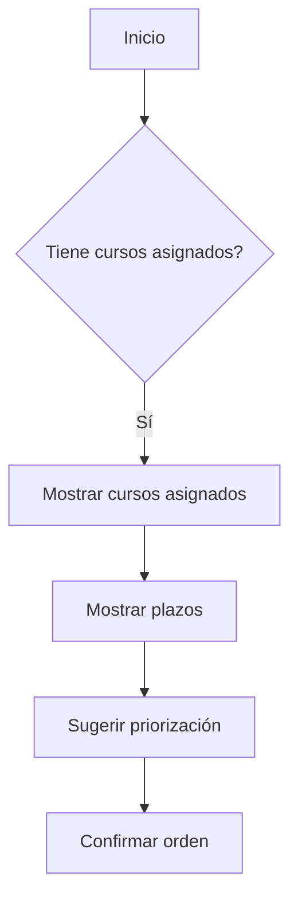
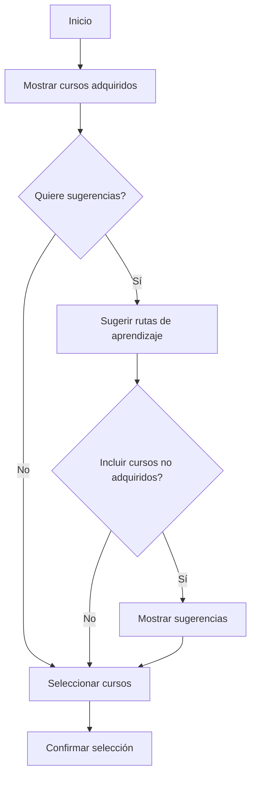

# Flujo Conversacional del Planificador de Estudios con LIA

Este documento describe el flujo conversacional completo que sigue LIA para guiar al usuario en la creación de su plan de estudios.

## Índice

1. [Visión General](#visión-general)
2. [Diferencias B2B vs B2C](#diferencias-b2b-vs-b2c)
3. [Fases del Flujo](#fases-del-flujo)
4. [Reglas de Validación](#reglas-de-validación)
5. [Integración con IA Generativa](#integración-con-ia-generativa)

---

## Visión General

LIA actúa como asistente conversacional que guía al usuario a través de 7 fases para crear un plan de estudio personalizado. El flujo se adapta según el tipo de usuario (B2B o B2C).

### Principios Clave

1. **Conversacional**: LIA interactúa mediante voz y texto de forma natural
2. **Personalizado**: Todo se adapta al perfil profesional del usuario
3. **IA Generativa**: Los cálculos no usan valores predefinidos, sino análisis de IA
4. **Validación continua**: Cada fase valida los datos antes de avanzar

---

## Diferencias B2B vs B2C

### Usuario B2B (Empresarial)

| Aspecto | Comportamiento |
|---------|----------------|
| Cursos | Asignados por la organización |
| Plazos | Fijos (establecidos por administrador) |
| Selección de cursos | NO permitida |
| Metas de tiempo | Deben cumplir plazos |
| Modificaciones | Limitadas por restricciones |

**Identificación B2B:**
```typescript
const isB2B = user.organization_id !== null;
```

### Usuario B2C (Individual)

| Aspecto | Comportamiento |
|---------|----------------|
| Cursos | Seleccionados por el usuario |
| Plazos | Opcionales o flexibles |
| Selección de cursos | Libre entre cursos adquiridos |
| Metas de tiempo | Flexibles o sin metas fijas |
| Modificaciones | Totalmente flexibles |

**Identificación B2C:**
```typescript
const isB2C = user.organization_id === null;
```

---

## Fases del Flujo

### Fase 0: Bienvenida

**Objetivo:** Introducir a LIA y explicar el proceso.

**Acciones de LIA:**
1. Saludar al usuario por nombre (si disponible)
2. Explicar las capacidades del planificador
3. Mencionar si el plan será automático o manual
4. Preparar al usuario para el proceso

**Datos recopilados:** Ninguno

---

### Fase 1: Análisis de Contexto

**Objetivo:** Analizar el perfil profesional y estimar disponibilidad.

**Acciones de LIA:**
1. Obtener perfil profesional del usuario
2. Identificar tipo de usuario (B2B/B2C)
3. Usar IA generativa para estimar disponibilidad basándose en:
   - Rol profesional (C-Level tiene menos tiempo)
   - Tamaño de empresa (más empleados = menos tiempo)
   - Área profesional
   - Nivel jerárquico
4. Presentar análisis al usuario
5. Confirmar si el análisis es correcto

**Datos recopilados:**
- `userType`: 'b2b' | 'b2c'
- `userProfile`: Perfil profesional completo
- `availabilityAnalysis`: Análisis inicial de LIA

**Prompt para LIA:**
```
Analiza el perfil del usuario y estima su disponibilidad semanal para estudio.
Considera: rol, área, nivel jerárquico, tamaño de empresa.
NO uses valores predefinidos, razona sobre cada factor.
```

---

### Fase 2: Selección de Cursos

**Objetivo:** Definir qué cursos incluir en el plan.

#### Flujo B2B



**Acciones:**
1. LIA obtiene cursos de `organization_course_assignments`
2. Presenta cursos con sus plazos
3. Destaca cursos con plazos próximos
4. Sugiere priorización
5. NO pregunta por otros cursos

#### Flujo B2C



**Acciones:**
1. LIA muestra cursos de `course_purchases`
2. Pregunta cuáles incluir
3. Opcionalmente sugiere rutas de aprendizaje (estilo Platzi)
4. Puede sugerir cursos adicionales no adquiridos
5. Confirma selección final

**Datos recopilados:**
- `selectedCourseIds`: Array de IDs de cursos
- `learningRouteId`: ID de ruta seleccionada (opcional)

---

### Fase 3: Integración con Calendario

**Objetivo:** Conectar y analizar el calendario del usuario.

**REGLA CRÍTICA:** Esta fase es OBLIGATORIA antes de estimar tiempos.

**Acciones de LIA:**
1. Verificar si hay calendario conectado
2. Si no está conectado:
   - Solicitar conexión
   - Explicar beneficios
   - Esperar conexión
3. Una vez conectado:
   - Obtener eventos (próximas 2 semanas)
   - Analizar disponibilidad
   - Identificar patrones (mañanas ocupadas, etc.)
4. Presentar análisis de disponibilidad

**Datos recopilados:**
- `calendarConnected`: boolean
- `calendarProvider`: 'google' | 'microsoft'
- `calendarEvents`: Array de eventos
- `calendarAvailability`: Análisis de disponibilidad

**Endpoints utilizados:**
- `POST /api/study-planner/calendar/connect`
- `GET /api/study-planner/calendar/availability`
- `POST /api/study-planner/calendar/analyze`

---

### Fase 4: Configuración de Tiempos

**Objetivo:** Establecer tiempos mínimos y máximos de sesiones.

**REGLA CRÍTICA:** Tiempo mínimo >= duración de lección más corta.

**Acciones de LIA:**
1. Calcular duración de lección más corta de los cursos seleccionados
2. Considerar análisis de calendario
3. Sugerir tiempos basándose en:
   - Disponibilidad del calendario
   - Perfil profesional
   - Complejidad de cursos
4. Para B2B: Validar que tiempos permitan cumplir plazos
5. Presentar sugerencias
6. Permitir ajustes del usuario
7. Validar ajustes

**Datos recopilados:**
- `minSessionMinutes`: Tiempo mínimo de sesión
- `maxSessionMinutes`: Tiempo máximo de sesión

**Validaciones:**
```typescript
// Tiempo mínimo >= lección más corta
if (minSessionMinutes < minimumLessonTime) {
  error("El tiempo mínimo debe permitir completar al menos una lección");
}

// Para B2B: verificar plazos
if (userType === 'b2b') {
  const canMeetDeadlines = validateB2BDeadlines(courses, weeklyStudyMinutes);
  if (!canMeetDeadlines) {
    warning("Los tiempos configurados no permiten cumplir los plazos");
    suggestAlternatives();
  }
}
```

---

### Fase 5: Tiempos de Descanso

**Objetivo:** Calcular tiempos de descanso óptimos.

**REGLA:** LIA calcula automáticamente basándose en mejores prácticas.

**Mejores prácticas consideradas:**
- Técnica Pomodoro: 25 min estudio + 5 min descanso
- Sesiones 45-60 min: 10-15 min descanso
- Sesiones 90+ min: 15-20 min descanso

**Acciones de LIA:**
1. Analizar duración de sesiones configurada
2. Calcular descanso óptimo usando IA
3. Explicar razonamiento
4. Permitir ajustes del usuario

**Datos recopilados:**
- `breakDurationMinutes`: Tiempo de descanso

---

### Fase 6: Días y Horarios

**Objetivo:** Configurar cuándo estudiar.

**Acciones de LIA:**
1. Preguntar días preferidos (Lun-Dom)
2. Preguntar horarios:
   - Opción genérica: mañana/tarde/noche
   - Opción específica: horas:minutos exactos
3. Validar contra:
   - Disponibilidad del calendario
   - Tiempos mínimos/máximos configurados
   - Tiempos de descanso
4. Si hay conflictos, sugerir alternativas

**Datos recopilados:**
- `preferredDays`: Array de días (0-6)
- `preferredTimeBlocks`: Bloques de tiempo
- `preferredTimeOfDay`: Momento del día preferido

**Validaciones:**
```typescript
// Verificar que bloques tengan duración suficiente
for (const block of timeBlocks) {
  const duration = calculateBlockDuration(block);
  if (duration < minSessionMinutes) {
    warning(`El bloque ${block} es menor que el tiempo mínimo de sesión`);
  }
}

// Verificar conflictos con calendario
for (const event of calendarEvents) {
  for (const block of timeBlocks) {
    if (overlaps(event, block)) {
      warning(`Conflicto con evento: ${event.title}`);
    }
  }
}
```

---

### Fase 7: Resumen y Confirmación

**Objetivo:** Presentar plan completo y obtener confirmación.

**Acciones de LIA:**
1. Generar resumen completo:
   - Información del usuario
   - Cursos incluidos
   - Tiempos de sesión
   - Tiempos de descanso
   - Días y horarios
   - Plazos (B2B)
   - Estimaciones (semanas, sesiones, horas totales)
2. Mostrar advertencias si hay
3. Ofrecer opción de modificar
4. Si el usuario acepta:
   - Generar sesiones
   - Guardar plan en BD

**Datos recopilados:**
- `planConfig`: Configuración final
- `generatedSessions`: Sesiones generadas

**Endpoints utilizados:**
- `POST /api/study-planner/generate-plan`
- `POST /api/study-planner/save-plan`

---

## Reglas de Validación

### Validaciones Críticas

| Regla | Descripción | Fase |
|-------|-------------|------|
| MIN_SESSION | Tiempo mínimo >= duración lección más corta | 4 |
| CALENDAR_REQUIRED | Calendario debe conectarse antes de estimar tiempos | 3 |
| B2B_DEADLINES | Tiempos deben permitir cumplir plazos B2B | 4, 6, 7 |
| NO_CALENDAR_CONFLICTS | Sesiones no deben solaparse con eventos | 6, 7 |
| VALID_TIME_BLOCKS | Bloques de tiempo deben ser >= tiempo mínimo | 6 |

### Validaciones de Advertencia

| Regla | Descripción |
|-------|-------------|
| SESSION_TOO_LONG | Sesiones > 120 min pueden afectar concentración |
| NO_BREAKS | Descansos de 0 min no son recomendables |
| FEW_DAYS | Estudiar < 3 días/semana dificulta retención |
| TIGHT_MARGIN | B2B: Poco margen para completar antes del plazo |

---

## Integración con IA Generativa

### Cálculos que debe realizar LIA

1. **Estimación de disponibilidad**
   - Input: Perfil profesional, calendario
   - Output: Minutos semanales estimados

2. **Tiempos de sesión sugeridos**
   - Input: Disponibilidad, complejidad cursos, plazos
   - Output: min/max minutos de sesión

3. **Tiempos de descanso**
   - Input: Duración de sesión
   - Output: Minutos de descanso

4. **Sugerencia de rutas de aprendizaje**
   - Input: Cursos, perfil, habilidades objetivo
   - Output: Rutas personalizadas

### Prompt Base para LIA

```
Eres LIA, la asistente del Planificador de Estudios.
Estás en la Fase {FASE} del flujo.

CONTEXTO DEL USUARIO:
{CONTEXTO_FORMATEADO}

INSTRUCCIONES DE LA FASE:
{INSTRUCCIONES_FASE}

REGLAS:
- Usa IA generativa para TODOS los cálculos
- NO uses valores predefinidos
- Explica tu razonamiento
- Valida contra las reglas críticas
- Sé conversacional y amigable
```

---

## Diagrama de Estados

```
WELCOME ─────────────────────────────────────────────────────────────────┐
    │                                                                    │
    v                                                                    │
CONTEXT_ANALYSIS ────────────────────────────────────────────────────────┤
    │                                                                    │
    v                                                                    │
COURSE_SELECTION ────────────────────────────────────────────────────────┤
    │                                                                    │
    v                                                                    │
CALENDAR_INTEGRATION ────────────────────────────────────────────────────┤
    │                                                                    │
    v                                                                    │
TIME_CONFIGURATION ──────────────────────────────────────────────────────┤
    │                                                                    │
    v                                                                    │
BREAK_CONFIGURATION ─────────────────────────────────────────────────────┤
    │                                                                    │
    v                                                                    │
SCHEDULE_CONFIGURATION ──────────────────────────────────────────────────┤
    │                                                                    │
    v                                                                    │
SUMMARY ─────────────────────────────────────────────────────────────────┤
    │                                                      │             │
    │ [Confirmar]                              [Modificar] │             │
    v                                                      │             │
COMPLETE <──────────────────────────────────── (volver a fase anterior)  │
                                                                         │
[Cancelar en cualquier fase] ────────────────────────────────────────────┘
```

---

## Notas de Implementación

### Estado Persistente

El estado del flujo se mantiene en:
1. `StudyPlannerContext` (React Context)
2. `useStudyPlannerLIA` (Hook con estado local)
3. LocalStorage (opcional, para recuperar sesiones)

### Mensajes Conversacionales

Cada fase tiene:
- Mensaje inicial de LIA
- Posibles preguntas del usuario
- Respuestas predefinidas para casos comunes
- Manejo de errores conversacional

### Voice First

LIA está diseñada para interacción por voz:
- Respuestas concisas y claras
- Evitar markdown complejo
- Usar pausas naturales
- Confirmar acciones importantes

